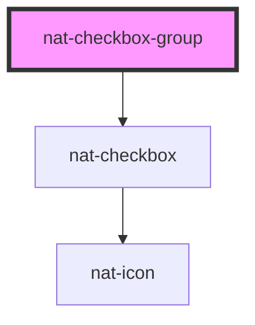

# nat-checkbox-group

<!-- Auto Generated Below -->

## Overview

Checkbox group for multiple selections

## Properties

| Property            | Attribute          | Description                   | Type                         | Default        |
| ------------------- | ------------------ | ----------------------------- | ---------------------------- | -------------- |
| `description`       | `description`      | Group description             | `string`                     | `undefined`    |
| `direction`         | `direction`        | Layout direction              | `"horizontal" \| "vertical"` | `'vertical'`   |
| `disabled`          | `disabled`         | Whether the group is disabled | `boolean`                    | `false`        |
| `error`             | `error`            | Error state                   | `boolean`                    | `false`        |
| `errorMessage`      | `error-message`    | Error message                 | `string`                     | `undefined`    |
| `label`             | `label`            | Group label                   | `string`                     | `undefined`    |
| `name` _(required)_ | `name`             | Group name                    | `string`                     | `undefined`    |
| `options`           | --                 | Array of checkbox options     | `CheckboxOption[]`           | `[]`           |
| `required`          | `required`         | Whether the group is required | `boolean`                    | `false`        |
| `selectAllLabel`    | `select-all-label` | Select all label              | `string`                     | `'Select All'` |
| `showSelectAll`     | `show-select-all`  | Show select all checkbox      | `boolean`                    | `false`        |
| `size`              | `size`             | Size variant                  | `"lg" \| "md" \| "sm"`       | `'md'`         |
| `value`             | --                 | Selected values               | `string[]`                   | `[]`           |

## Events

| Event          | Description                     | Type                                                                   |
| -------------- | ------------------------------- | ---------------------------------------------------------------------- |
| `natChange`    | Emitted when selection changes  | `CustomEvent<{ value: string[]; selectedOptions: CheckboxOption[]; }>` |
| `natSelectAll` | Emitted when select all changes | `CustomEvent<{ checked: boolean; allValues: string[]; }>`              |

## Slots

| Slot | Description                                        |
| ---- | -------------------------------------------------- |
|      | Custom options content (if not using options prop) |

## Dependencies

### Depends on

- [nat-checkbox](../nat-checkbox)

### Graph

----------------------------------------------

