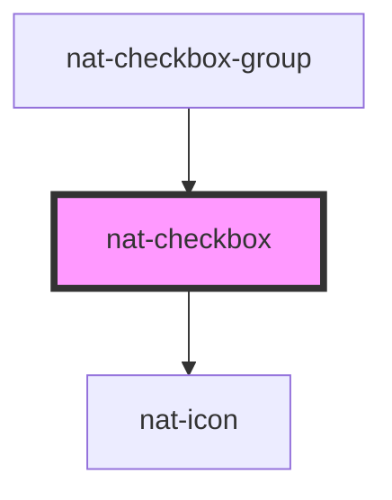

# nat-checkbox

<!-- Auto Generated Below -->

## Properties

| Property        | Attribute       | Description                                                               | Type                   | Default     |
| --------------- | --------------- | ------------------------------------------------------------------------- | ---------------------- | ----------- |
| `ariaLabel`     | `aria-label`    | Aria label for accessibility                                              | `string`               | `undefined` |
| `checked`       | `checked`       | If true, the checkbox is checked                                          | `boolean`              | `false`     |
| `disabled`      | `disabled`      | If true, the checkbox is disabled                                         | `boolean`              | `false`     |
| `indeterminate` | `indeterminate` | If true, the checkbox is in indeterminate state (mixed/partial selection) | `boolean`              | `false`     |
| `label`         | `label`         | Label text for the checkbox                                               | `string`               | `''`        |
| `name`          | `name`          | Name attribute for form submission                                        | `string`               | `''`        |
| `required`      | `required`      | If true, the checkbox is required                                         | `boolean`              | `false`     |
| `size`          | `size`          | Size variant of the checkbox                                              | `"lg" \| "md" \| "sm"` | `'md'`      |
| `value`         | `value`         | Value attribute for form submission                                       | `string`               | `'on'`      |

## Events

| Event       | Description                              | Type                   |
| ----------- | ---------------------------------------- | ---------------------- |
| `natBlur`   | Emitted when the checkbox loses focus    | `CustomEvent<void>`    |
| `natChange` | Emitted when the checked state changes   | `CustomEvent<boolean>` |
| `natFocus`  | Emitted when the checkbox receives focus | `CustomEvent<void>`    |

## Slots

| Slot | Description                               |
| ---- | ----------------------------------------- |
|      | Label content (alternative to label prop) |

## Dependencies

### Used by

 - [nat-checkbox-group](../nat-checkbox-group)

### Depends on

- [nat-icon](../nat-icon)

### Graph

----------------------------------------------

