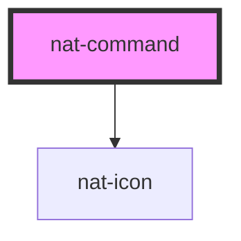

# nat-command

<!-- Auto Generated Below -->

## Overview

Command palette — keyboard-driven command menu inspired by Linear and Vercel.
Open with Cmd+K / Ctrl+K or call `.open()` programmatically.

## Properties

| Property         | Attribute         | Description                                                       | Type            | Default                       |
| ---------------- | ----------------- | ----------------------------------------------------------------- | --------------- | ----------------------------- |
| `globalShortcut` | `global-shortcut` | If true, pressing Cmd+K / Ctrl+K globally opens the palette       | `boolean`       | `true`                        |
| `items`          | --                | Flat list of command items. Group them with the `group` property. | `CommandItem[]` | `[]`                          |
| `maxResults`     | `max-results`     | Maximum number of results to show at once                         | `number`        | `8`                           |
| `placeholder`    | `placeholder`     | Placeholder text for the search input                             | `string`        | `'Type a command or search…'` |

## Events

| Event       | Description                             | Type                       |
| ----------- | --------------------------------------- | -------------------------- |
| `natClose`  | Emitted when the palette closes         | `CustomEvent<void>`        |
| `natOpen`   | Emitted when the palette opens          | `CustomEvent<void>`        |
| `natSelect` | Emitted when a command item is selected | `CustomEvent<CommandItem>` |

## Methods

### `close() => Promise<void>`

Close the command palette

#### Returns

Type: `Promise<void>`

### `open() => Promise<void>`

Open the command palette

#### Returns

Type: `Promise<void>`

## Slots

| Slot        | Description                                     |
| ----------- | ----------------------------------------------- |
| `"trigger"` | Optional trigger element that opens the palette |

## Dependencies

### Depends on

- [nat-icon](../nat-icon)

### Graph

----------------------------------------------

