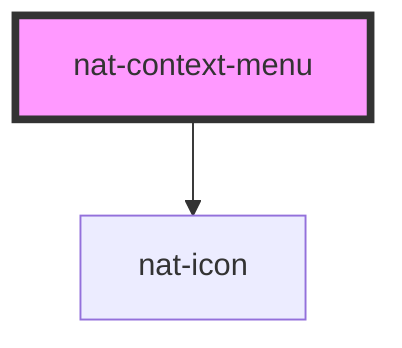

# nat-context-menu

<!-- Auto Generated Below -->

## Overview

Context menu — triggered by right-click on the default slot.
Supports icons, keyboard shortcuts, separators, danger items, and sub-menus.

## Properties

| Property | Attribute | Description      | Type                | Default |
| -------- | --------- | ---------------- | ------------------- | ------- |
| `glass`  | `glass`   | Glass style menu | `boolean`           | `false` |
| `items`  | --        | Menu items array | `ContextMenuItem[]` | `[]`    |

## Events

| Event       | Description                          | Type                           |
| ----------- | ------------------------------------ | ------------------------------ |
| `natSelect` | Emitted when a menu item is selected | `CustomEvent<ContextMenuItem>` |

## Methods

### `close() => Promise<void>`

Close the context menu

#### Returns

Type: `Promise<void>`

## Slots

| Slot | Description                                               |
| ---- | --------------------------------------------------------- |
|      | The element that triggers the context menu on right-click |

## Dependencies

### Depends on

- [nat-icon](../nat-icon)

### Graph

----------------------------------------------

