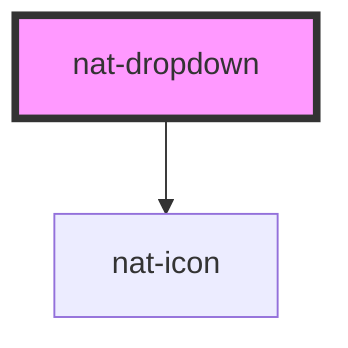

# nat-dropdown

<!-- Auto Generated Below -->

## Properties

| Property     | Attribute    | Description                             | Type                          | Default     |
| ------------ | ------------ | --------------------------------------- | ----------------------------- | ----------- |
| `ariaLabel`  | `aria-label` | ARIA label                              | `string`                      | `undefined` |
| `clearable`  | `clearable`  | Allow clear                             | `boolean`                     | `false`     |
| `disabled`   | `disabled`   | Disabled state                          | `boolean`                     | `false`     |
| `label`      | `label`      | Label for controlled input              | `string`                      | `undefined` |
| `multiple`   | `multiple`   | Multi-select support                    | `boolean`                     | `false`     |
| `options`    | --           | List of options                         | `DropdownOption[]`            | `[]`        |
| `placement`  | `placement`  | Placement of dropdown (bottom/top/auto) | `"auto" \| "bottom" \| "top"` | `'auto'`    |
| `searchable` | `searchable` | Allow search/filter                     | `boolean`                     | `false`     |
| `value`      | `value`      | Current selected value (single select)  | `string`                      | `undefined` |
| `values`     | --           |                                         | `string[]`                    | `[]`        |

## Events

| Event       | Description                      | Type                                                                   |
| ----------- | -------------------------------- | ---------------------------------------------------------------------- |
| `natChange` | Emits when selection changes     | `CustomEvent<{ value: string \| string[]; option?: DropdownOption; }>` |
| `natClose`  |                                  | `CustomEvent<void>`                                                    |
| `natOpen`   | Emits when dropdown opens/closes | `CustomEvent<void>`                                                    |

## Dependencies

### Depends on

- [nat-icon](../nat-icon)

### Graph

----------------------------------------------

