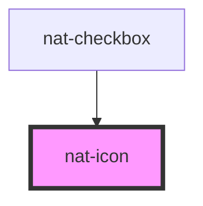

# nat-icon

<!-- Auto Generated Below -->

## Overview

Icon component with registry system support.
Supports loading icons from registered libraries or direct SVG URLs.

## Properties

| Property     | Attribute    | Description                                                                        | Type      | Default     |
| ------------ | ------------ | ---------------------------------------------------------------------------------- | --------- | ----------- |
| `decorative` | `decorative` | If true, icon is decorative and hidden from screen readers                         | `boolean` | `false`     |
| `label`      | `label`      | Accessible label for screen readers Required for icons without accompanying text   | `string`  | `undefined` |
| `library`    | `library`    | Icon library to use (must be registered first)                                     | `string`  | `'default'` |
| `name`       | `name`       | Name of the icon from the registered library                                       | `string`  | `undefined` |
| `src`        | `src`        | Direct SVG source URL (bypasses icon library) Takes precedence over name + library | `string`  | `undefined` |

## Slots

| Slot | Description                              |
| ---- | ---------------------------------------- |
|      | Fallback content when icon fails to load |

## Dependencies

### Used by

 - [nat-checkbox](../nat-checkbox)

### Graph

----------------------------------------------

