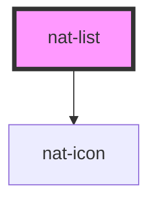

# nat-list

<!-- Auto Generated Below -->

## Properties

| Property     | Attribute    | Description                 | Type         | Default |
| ------------ | ------------ | --------------------------- | ------------ | ------- |
| `compact`    | `compact`    | Compact spacing             | `boolean`    | `false` |
| `dividers`   | `dividers`   | Show dividers between items | `boolean`    | `false` |
| `horizontal` | `horizontal` | Horizontal layout           | `boolean`    | `false` |
| `items`      | --           | List items data             | `ListItem[]` | `[]`    |

## Events

| Event          | Description                | Type                    |
| -------------- | -------------------------- | ----------------------- |
| `natItemClick` | Emits when item is clicked | `CustomEvent<ListItem>` |

## Dependencies

### Depends on

- [nat-icon](../nat-icon)

### Graph

----------------------------------------------

