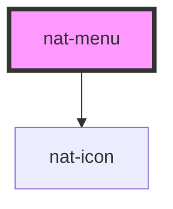

# nat-menu

<!-- Auto Generated Below -->

## Overview

Menu component (dropdown, context menu)

## Properties

| Property    | Attribute   | Description                       | Type                                                         | Default          |
| ----------- | ----------- | --------------------------------- | ------------------------------------------------------------ | ---------------- |
| `items`     | --          | Items prop (can use slot instead) | `MenuItem[]`                                                 | `[]`             |
| `label`     | `label`     | ARIA label                        | `string`                                                     | `'Menu'`         |
| `open`      | `open`      | Is menu open                      | `boolean`                                                    | `false`          |
| `placement` | `placement` | Placement relative to trigger     | `"bottom-end" \| "bottom-start" \| "top-end" \| "top-start"` | `'bottom-start'` |
| `size`      | `size`      | Size                              | `"lg" \| "md" \| "sm"`                                       | `'md'`           |

## Events

| Event       | Description            | Type                    |
| ----------- | ---------------------- | ----------------------- |
| `natClose`  | Emits when menu closes | `CustomEvent<void>`     |
| `natOpen`   | Emits when menu opens  | `CustomEvent<void>`     |
| `natSelect` | Emits selected value   | `CustomEvent<MenuItem>` |

## Slots

| Slot        | Description                  |
| ----------- | ---------------------------- |
|             | custom menu items            |
| `"trigger"` | menu trigger button/icon/etc |

## Dependencies

### Depends on

- [nat-icon](../nat-icon)

### Graph

----------------------------------------------

