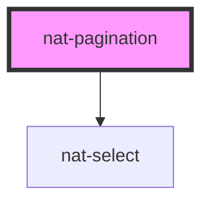

# nat-pagination

<!-- Auto Generated Below -->

## Overview

Pagination component for page navigation

## Properties

| Property          | Attribute       | Description                                      | Type       | Default        |
| ----------------- | --------------- | ------------------------------------------------ | ---------- | -------------- |
| `compact`         | `compact`       | Compact mode                                     | `boolean`  | `false`        |
| `current`         | `current`       | Current active page                              | `number`   | `1`            |
| `disabled`        | `disabled`      | Disabled state                                   | `boolean`  | `false`        |
| `labelFirst`      | `label-first`   |                                                  | `string`   | `'First'`      |
| `labelLast`       | `label-last`    |                                                  | `string`   | `'Last'`       |
| `labelNext`       | `label-next`    |                                                  | `string`   | `'Next'`       |
| `labelOf`         | `label-of`      |                                                  | `string`   | `'of'`         |
| `labelPage`       | `label-page`    |                                                  | `string`   | `'Page'`       |
| `labelPrev`       | `label-prev`    | i18n                                             | `string`   | `'Prev'`       |
| `pageSize`        | `page-size`     | Current size                                     | `number`   | `10`           |
| `pageSizeOptions` | --              | Show page size selector                          | `number[]` | `[10, 20, 50]` |
| `showEnds`        | `show-ends`     | Show first/last buttons                          | `boolean`  | `true`         |
| `showJump`        | `show-jump`     | Show jump-to-page                                | `boolean`  | `false`        |
| `siblingCount`    | `sibling-count` | Number of page buttons to display around current | `number`   | `1`            |
| `total`           | `total`         | Total number of pages                            | `number`   | `1`            |

## Events

| Event               | Description                    | Type                                               |
| ------------------- | ------------------------------ | -------------------------------------------------- |
| `natChange`         | Emitted when page changes      | `CustomEvent<{ page: number; pageSize: number; }>` |
| `natPageSizeChange` | Emitted when page size changes | `CustomEvent<{ pageSize: number; }>`               |

## Slots

| Slot | Description               |
| ---- | ------------------------- |
|      | Custom content (optional) |

## Dependencies

### Depends on

- [nat-select](../nat-select)

### Graph

----------------------------------------------

