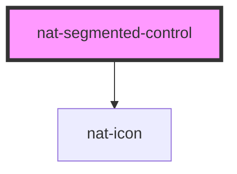

# nat-segmented-control

<!-- Auto Generated Below -->

## Overview

iOS-style segmented control — animated sliding pill selector.

## Properties

| Property    | Attribute    | Description              | Type                   | Default |
| ----------- | ------------ | ------------------------ | ---------------------- | ------- |
| `fullWidth` | `full-width` | Full width of container  | `boolean`              | `false` |
| `glass`     | `glass`      | Glass style background   | `boolean`              | `false` |
| `options`   | --           | Array of segment options | `SegmentOption[]`      | `[]`    |
| `size`      | `size`       | Size variant             | `"lg" \| "md" \| "sm"` | `'md'`  |
| `value`     | `value`      | Currently selected value | `string`               | `''`    |

## Events

| Event       | Description                             | Type                  |
| ----------- | --------------------------------------- | --------------------- |
| `natChange` | Emitted when the selected value changes | `CustomEvent<string>` |

## Dependencies

### Depends on

- [nat-icon](../nat-icon)

### Graph

----------------------------------------------

