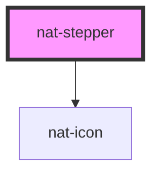

# nat-stepper

<!-- Auto Generated Below -->

## Properties

| Property    | Attribute   | Description          | Type            | Default |
| ----------- | ----------- | -------------------- | --------------- | ------- |
| `active`    | `active`    | Which step is active | `number`        | `0`     |
| `clickable` | `clickable` | Clickable steps      | `boolean`       | `false` |
| `steps`     | --          | Steps list           | `StepperStep[]` | `[]`    |
| `vertical`  | `vertical`  | Layout orientation   | `boolean`       | `false` |

## Events

| Event       | Description             | Type                                             |
| ----------- | ----------------------- | ------------------------------------------------ |
| `natChange` | Emits when step changes | `CustomEvent<{ index: number; value: string; }>` |

## Dependencies

### Depends on

- [nat-icon](../nat-icon)

### Graph

----------------------------------------------

