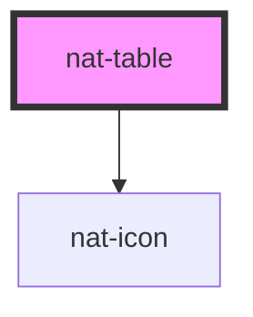

# nat-table

<!-- Auto Generated Below -->

## Properties

| Property   | Attribute  | Description        | Type                    | Default |
| ---------- | ---------- | ------------------ | ----------------------- | ------- |
| `columns`  | --         | Columns definition | `TableColumn[]`         | `[]`    |
| `rows`     | --         | Data rows          | `Record<string, any>[]` | `[]`    |
| `sortable` | `sortable` | Enable sorting     | `boolean`               | `false` |

## Dependencies

### Depends on

- [nat-icon](../nat-icon)

### Graph

----------------------------------------------

