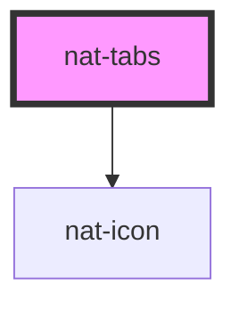

# nat-tabs

<!-- Auto Generated Below -->

## Overview

Tabs navigation with animated indicator

## Properties

| Property   | Attribute  | Description              | Type                                                        | Default     |
| ---------- | ---------- | ------------------------ | ----------------------------------------------------------- | ----------- |
| `color`    | `color`    | Color variant            | `"danger" \| "info" \| "primary" \| "success" \| "warning"` | `'primary'` |
| `size`     | `size`     | Size variant             | `"lg" \| "md" \| "sm"`                                      | `'md'`      |
| `tabs`     | --         | Tab items                | `TabItem[]`                                                 | `[]`        |
| `value`    | `value`    | Current active tab value | `string`                                                    | `undefined` |
| `vertical` | `vertical` | Vertical mode            | `boolean`                                                   | `false`     |

## Events

| Event       | Description                 | Type                              |
| ----------- | --------------------------- | --------------------------------- |
| `natChange` | Emitted when tab is changed | `CustomEvent<{ value: string; }>` |

## Slots

| Slot | Description                                                           |
| ---- | --------------------------------------------------------------------- |
|      | Tab panel content (one element per tab, use slot="panel-{tab.value}") |

## Dependencies

### Depends on

- [nat-icon](../nat-icon)

### Graph

----------------------------------------------

