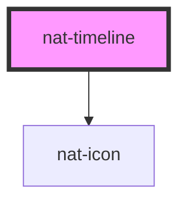

# nat-timeline

<!-- Auto Generated Below -->

## Overview

Vertical timeline for displaying a sequence of events.

## Properties

| Property    | Attribute   | Description                                           | Type                                           | Default |
| ----------- | ----------- | ----------------------------------------------------- | ---------------------------------------------- | ------- |
| `alternate` | `alternate` | If true, alternates items left/right (zigzag layout)  | `boolean`                                      | `false` |
| `dashed`    | `dashed`    | If true, the connecting line between events is dashed | `boolean`                                      | `false` |
| `items`     | --          | Array of timeline events                              | `TimelineItem[]`                               | `[]`    |
| `reverse`   | `reverse`   | If true, renders items in reverse chronological order | `boolean`                                      | `false` |
| `variant`   | `variant`   | Visual style variant                                  | `"connected" \| "dot" \| "icon" \| "numbered"` | `'dot'` |

## Dependencies

### Depends on

- [nat-icon](../nat-icon)

### Graph

----------------------------------------------

