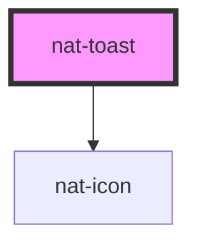

# nat-toast

<!-- Auto Generated Below -->

## Overview

Toast component for transient notifications

## Properties

| Property     | Attribute     | Description                                   | Type                                                                                              | Default          |
| ------------ | ------------- | --------------------------------------------- | ------------------------------------------------------------------------------------------------- | ---------------- |
| `closable`   | `closable`    | Show close (X) button                         | `boolean`                                                                                         | `true`           |
| `closeLabel` | `close-label` | ARIA label for close button                   | `string`                                                                                          | `'Close toast'`  |
| `duration`   | `duration`    | Dismiss automatically after X ms (0 = sticky) | `number`                                                                                          | `3500`           |
| `message`    | `message`     | Toast message (as fallback if not using slot) | `string`                                                                                          | `undefined`      |
| `open`       | `open`        | Visiblity control                             | `boolean`                                                                                         | `false`          |
| `position`   | `position`    | Position on viewport                          | `"bottom-center" \| "bottom-left" \| "bottom-right" \| "top-center" \| "top-left" \| "top-right"` | `'bottom-right'` |
| `variant`    | `variant`     | Toast type variant                            | `"danger" \| "info" \| "success" \| "warning"`                                                    | `'info'`         |

## Events

| Event      | Description               | Type                |
| ---------- | ------------------------- | ------------------- |
| `natClose` | Emitted when toast closes | `CustomEvent<void>` |

## Methods

### `close() => Promise<void>`

#### Returns

Type: `Promise<void>`

## Slots

| Slot | Description                       |
| ---- | --------------------------------- |
|      | Custom content (message, actions) |

## Dependencies

### Depends on

- [nat-icon](../nat-icon)

### Graph

----------------------------------------------

